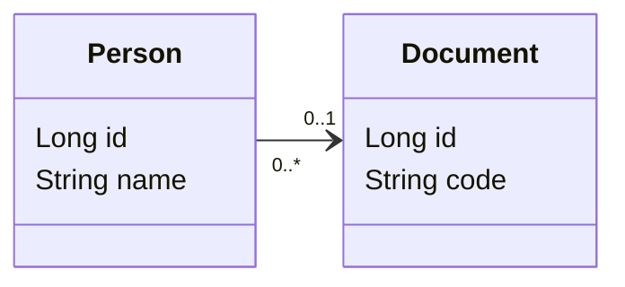
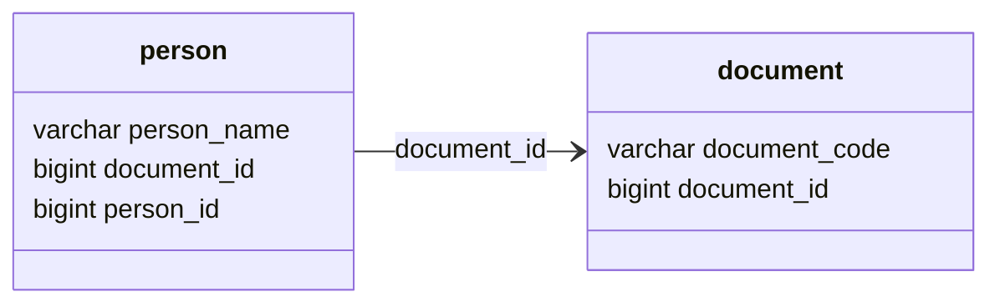

# POC: JPA Many-to-One

It demonstrates how to use JPA to implement many-to-one relationship.

The goal is to be able to persist information about people, documents and links between them. Every person must have one
or none document registered, and we want to make the references consistent.

In this example the `Document` entity may be linked to multiple `People` entities. We use the annotations `ManyToOne`
and `JoinTable` in the owner of the relationship, which is the `Person` entity, and do not set any references to it
in `Document` entity.

## How to run

| Description | Command          |
|:------------|:-----------------|
| Run tests   | `./gradlew test` |

## Preview

Entity Relationship Model:

Database schema:

